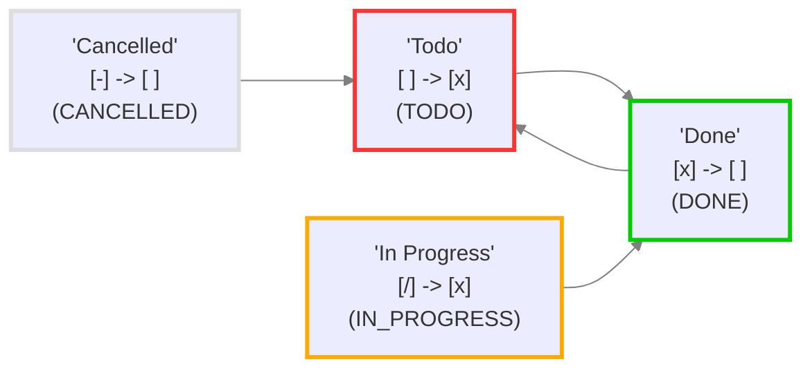

# 查看并检查您的状态

## 关于此文件

此文件由 Obsidian tasks 插件(version 7.22.0)创建,以帮助可视化此仓库中的任务状态.

如果更改 Tasks 状态设置,则可以通过以下方式获取更新后的报告:

- 前往 `设置` -> `Tasks`。
- 点击 `查看并检查您的状态`。

您可以随时删除此文件.

## 状态设置

<!--
切换到实时预览或阅读模式以查看表格.
如果状态名称中有任何Markdown格式字符,如 '*' 或 '_',
黑曜石只能在阅读模式下正确渲染表格.
-->

这些是核心和自定义状态部分中的状态值.

| 状态符号 | 下一个状态符号 | 状态名称 | 状态类型 | 问题 (如果存在) |
| ----- | ----- | ----- | ----- | ----- |
| `space` | `x` | Todo | `TODO` |  |
| `x` | `space` | Done | `DONE` |  |
| `/` | `x` | In Progress | `IN_PROGRESS` |  |
| `-` | `space` | Cancelled | `CANCELLED` |  |

## 已加载设置

<!-- 切换到实时预览或阅读模式以查看图表. -->

这些是 Tasks 实际使用的设置.




## 样例任务

这里是用于实际任务使用的各种状态的示例任务行，供您进行实验。

创建此文件时，任务描述中的状态符号和名称是正确的。

如果您自创建以来修改了样例任务，可以在下方的任务搜索的分组标题中查看当前的状态类型和名称。

> [!Tip] 提示：如果所有复选框看起来都一样...
> 如果在阅读模式或实时预览中所有复选框看起来都一样，请参阅[自定义状态样式](https://publish.obsidian.md/tasks/How+To/Style+custom+statuses)，了解如何选择主题或CSS片段来为您的状态设置样式。

- [ ] Sample task 1: status symbol=`space` status name='Todo'
- [x] Sample task 2: status symbol=`x` status name='Done'
- [/] Sample task 3: status symbol=`/` status name='In Progress'
- [-] Sample task 4: status symbol=`-` status name='Cancelled'

## 搜索样例任务

此任务搜索显示了此文件中的所有任务，按其状态类型和状态名称进行分组。

```tasks
path includes {{query.file.path}}
group by status.type
group by status.name
sort by function task.lineNumber
hide postpone button
short mode
```
